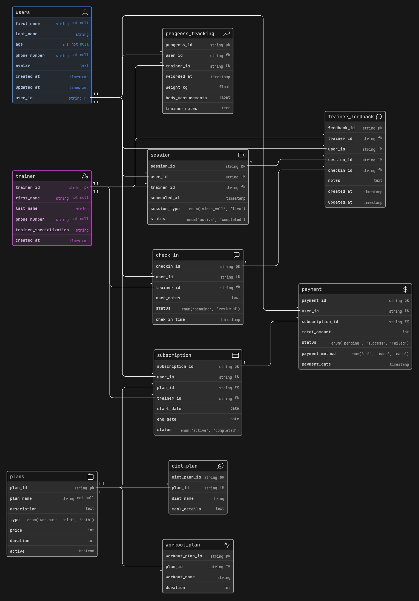

# Fitness Coaching Platform — Database Schema

This document describes the Entity-Relationship diagram for a Fitness Influencer Coaching Platform.

---

## Tables

| Table               | Description                                        |
| ------------------- | -------------------------------------------------- |
| `users`             | Registered users (name, age, phone)                |
| `trainer`           | Trainer profiles and specializations               |
| `plans`             | Subscription plans — workout, diet, or both        |
| `subscription`      | Links a user to a plan + trainer                   |
| `payment`           | Payment records for subscriptions                  |
| `session`           | Video call or live sessions between user & trainer |
| `check_in`          | User check-ins reviewed by trainers                |
| `progress_tracking` | Weight & body measurement logs                     |
| `trainer_feedback`  | Trainer notes tied to sessions or check-ins        |
| `diet_plan`         | Meal plans linked to a subscription plan           |
| `workout_plan`      | Workout routines linked to a subscription plan     |

---

## Relationships

- A **user** subscribes to a **plan** via `subscription`, which assigns a **trainer**
- Each subscription can have a **payment**, **sessions**, **check-ins**, and **progress logs**
- **Trainer feedback** can reference both a session and a check-in
- A **plan** can include a **diet_plan**, a **workout_plan**, or both

---
