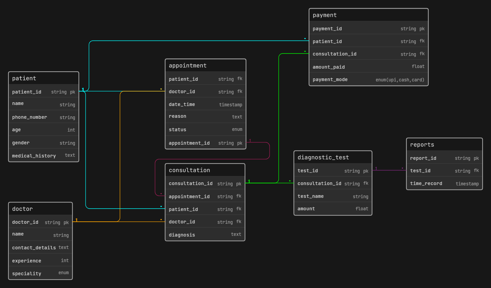

# Clinic Appointment and Diagnostics Platform

A database design for managing clinic.



---

## How It Works (Simple Flow)

```
Patient + Doctor → Appointment → Consultation → Diagnostic Test → Report → Payment
```

---

## Tables

Patient - Stores basic patient information.

Doctor - Stores doctor profiles.

Appointment - Created when a patient book a slot with a doctor.

Consultation - Recorded by the doctor after the appointment happens.

Diagnostic Test - Tests ordered during a consultation.

Reports - Test results.

Payment - Payment made by the patient after consultation/tests.

## Relationships

- One **patient** can have many **appointments**
- One **doctor** can have many **appointments**
- Each **appointment** leads to one **consultation**
- One **consultation** can have many **diagnostic tests**
- Each **diagnostic test** has one **report**
- Each **consultation** has one **payment**

---
