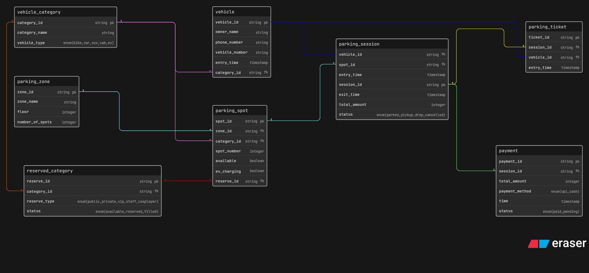

# Comic Con Parking System (Database Design)

This project contains the database schema for a Comic Con Parking System.
It helps manage vehicles, parking spots, sessions, tickets and payments.

---

## ER Diagram

---

## Tables Used

The system is built using the following tables:

- `vehicle_category` → Stores types of vehicle
- `vehicle` → Stores vehicle and owner details
- `parking_zone` → parking areas and floors
- `parking_spot` → Stores individual parking spot details
- `reserved_category` → Manages reserved parking types (VIP, staff, etc.)
- `parking_session` → Tracks entry, exit and parking activity
- `parking_ticket` → Generates tickets
- `payment` → Stores payment details

---

## Relationships

- `vehicle_category` → `vehicle` (One category can have many vehicles)

- `vehicle_category` → `parking_spot` (One category can have many spots)

- `vehicle_category` → `reserved_category` (One category can have many reservation types)

- `parking_zone` → `parking_spot` (One zone contains many parking spots)

- `reserved_category` → `parking_spot` (One reserved category can be assigned to many spots)

- `vehicle` → `parking_session` (One vehicle can have many sessions)

- `parking_spot` → `parking_session` (One spot can have many sessions over time)

- `parking_session` → `parking_ticket` (One session generates one ticket)

- `parking_session` → `payment` (One session has one payment)

---

## Basic Flow

vehicle_category → parking_zone → parking_spot → vehicle → parking_session → parking_ticket → payment

---
