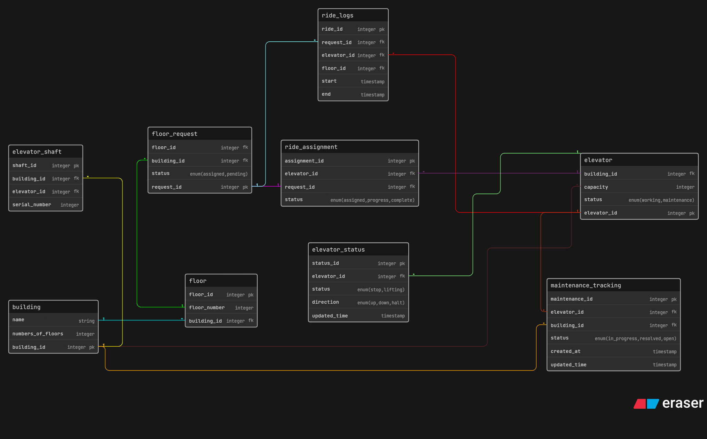

## Smart Elevator Control

A database design for Smart Elevator Control

---

---

## Flow

Floor + Building → Floor Request → Ride Assignment → Elevator Movement → Ride Logs → Elevator Status → Maintenance Tracking

## Tables

- **Building** → Stores building details
- **Floor** → Represents floors inside a building
- **Elevator** → Core elevator entity with capacity and status
- **Elevator Shaft** → Physical mapping of elevator inside building
- **Floor Request** → User-generated requests from floors
- **Ride Assignment** → Maps request to an elevator
- **Ride Logs** → Tracks start and end of rides
- **Elevator Status** → Real-time state of elevator
- **Maintenance Tracking** → Tracks maintenance lifecycle

## Relationships

- A **Building** has many Floors

- A **Building** has many Elevators

- A **Building** has many Elevator Shafts

- A **Floor** belongs to a Building

- A **Floor** can create multiple Requests

- A **Floor Request** is assigned to one Elevator via Ride Assignment

- An **Elevator** can handle multiple Ride Assignments

- Each **Ride Assignment** generates Ride Logs

- An **Elevator** has one active Status (updated frequently)

- An **Elevator** can have multiple Maintenance records

- **Maintenance Tracking** is linked to both Building and Elevator

- Each **Elevator Shaft** is mapped to one Elevator
